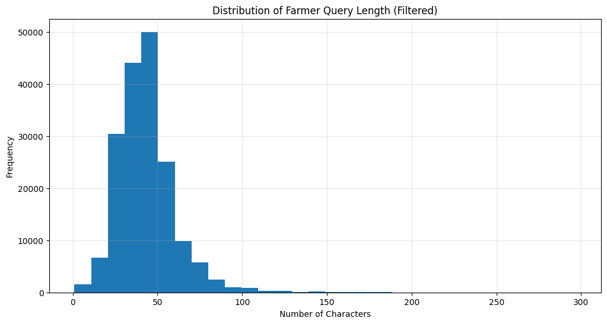
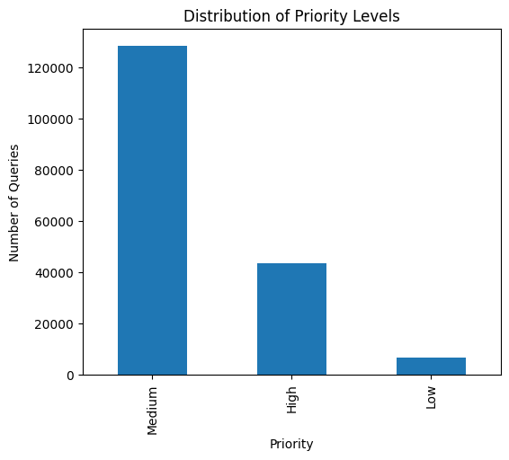
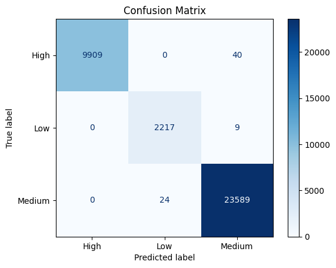

<div align="center">

# 🌾 AI-Based Farmer Query Prioritization System
### Smart Agricultural Advisory using Machine Learning & Natural Language Processing


</div>

---

# 📖 Overview

Agricultural advisory platforms receive thousands of farmer queries every day regarding crop diseases, pest attacks, irrigation, fertilizers, government schemes, and market prices.

Treating every query with equal priority can delay responses to critical situations such as disease outbreaks or severe pest infestations.

This project presents an **AI-Based Farmer Query Prioritization System** that automatically classifies farmer queries into:

- 🔴 High Priority
- 🟡 Medium Priority
- 🟢 Low Priority

using **Natural Language Processing (NLP)** and **Machine Learning**.

---

# 🎯 Objectives

- Analyze real farmer queries.
- Perform text preprocessing.
- Generate priority labels.
- Convert text into numerical features using TF-IDF.
- Train multiple Machine Learning models.
- Compare their performance.
- Predict priority for new farmer queries.

---

# 📂 Project Structure

```
AI-Based-Farmer-Query-Prioritization-System
│
├── dataset/
│   └── questionsv4.csv
│
├── images/
│   ├── query_length_histogram.png
│   ├── priority_distribution.png
│   ├── comparing_model.png
│   └── confusion_matrix.png
│
├── report/
│   └── PROJECT REPORT.docx
│
├── Farmer_Query_Prioritization_System.ipynb
├── requirements.txt
└── README.md
```

---

# 🧠 Workflow

```text
                Farmer Query
                      │
                      ▼
            Text Preprocessing
                      │
                      ▼
        Rule-Based Priority Labeling
                      │
                      ▼
          TF-IDF Feature Extraction
                      │
                      ▼
        Train/Test Split (80 : 20)
                      │
                      ▼
   ┌──────────────┬──────────────┬──────────────┐
   │              │              │              │
   ▼              ▼              ▼
Naive Bayes  Logistic Regression  Linear SVM
   │              │              │
   └──────────────┴──────────────┘
                  │
                  ▼
         Model Performance Evaluation
                  │
                  ▼
      High / Medium / Low Prediction
```

---

# 🗂 Dataset

The project uses a real agricultural dataset consisting of farmer questions and expert responses.

### Dataset Statistics

| Property | Value |
|----------|------:|
| Total Records | 178,939 |
| Features | 2 |
| Generated Features | 3 |
| Train-Test Split | 80 : 20 |

Original Features

- Questions
- Answers

Generated Features

- Query Length
- Intent
- Priority

---

# ⚙️ Technologies Used

| Category | Technology |
|----------|------------|
| Language | Python |
| Environment | Google Colab |
| Data Processing | Pandas, NumPy |
| Visualization | Matplotlib |
| NLP | TF-IDF Vectorizer |
| Machine Learning | Scikit-Learn |
| Model | Linear Support Vector Machine |

---

# 🤖 Machine Learning Models

The following models were trained and compared.

| Model | Accuracy |
|-------|----------:|
| Naive Bayes | **97.42%** |
| Logistic Regression | **99.59%** |
| Linear SVM | **99.80%** ✅ |

Linear SVM achieved the highest accuracy and was selected as the final model.

---

# 📊 Results

## Model Comparison

<p align="center">

</p>

---

## Query Length Distribution

<p align="center">

</p>

---

## Priority Distribution

<p align="center">

</p>

---

## Confusion Matrix

<p align="center">

</p>

The Linear SVM model demonstrated excellent performance with only a few misclassifications across all three priority classes.

---

# 💡 Example Predictions

| Farmer Query | Predicted Priority |
|--------------|-------------------|
| My tomato crop has suddenly dried after heavy rain. | 🔴 High |
| Aphids are attacking my cotton crop. | 🔴 High |
| Which fertilizer is suitable for paddy? | 🟡 Medium |
| When should I irrigate maize? | 🟡 Medium |
| What is today's wheat market price? | 🟢 Low |

---

# 🚀 Installation

Clone the repository

```bash
git clone https://github.com/learnersk-hub/AI-Based-Farmer-Query-Prioritization-System.git
```

Move into the project

```bash
cd AI-Based-Farmer-Query-Prioritization-System
```

Install dependencies

```bash
pip install -r requirements.txt
```

Launch Jupyter Notebook or Google Colab and run

```
Farmer_Query_Prioritization_System.ipynb
```

---

# 📈 Future Improvements

- Deep Learning Models
- BERT / RoBERTa based classification
- Multilingual farmer query support
- Explainable AI predictions
- Real-time deployment using Streamlit or Flask
- Integration with agricultural advisory platforms

---

# 📚 References

- Kaggle Agricultural Farmer Query Dataset
- Scikit-Learn Documentation
- Google Colaboratory
- Python Documentation

---

# 👨‍💻 Author

**Subodh Kushwaha**

B.Tech Electronics & Communication Engineering

University of Lucknow

---

<div align="center">

### ⭐ If you found this project useful, consider giving it a Star.

</div>
